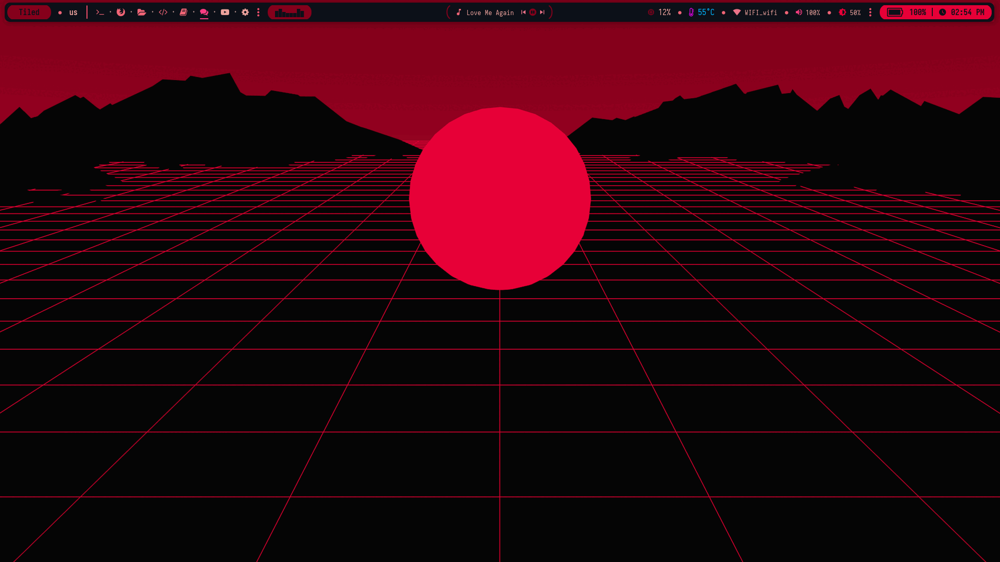
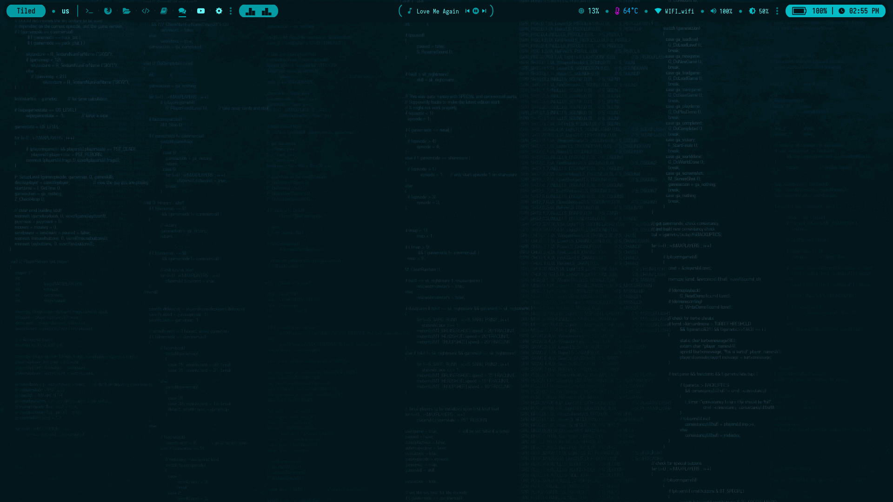
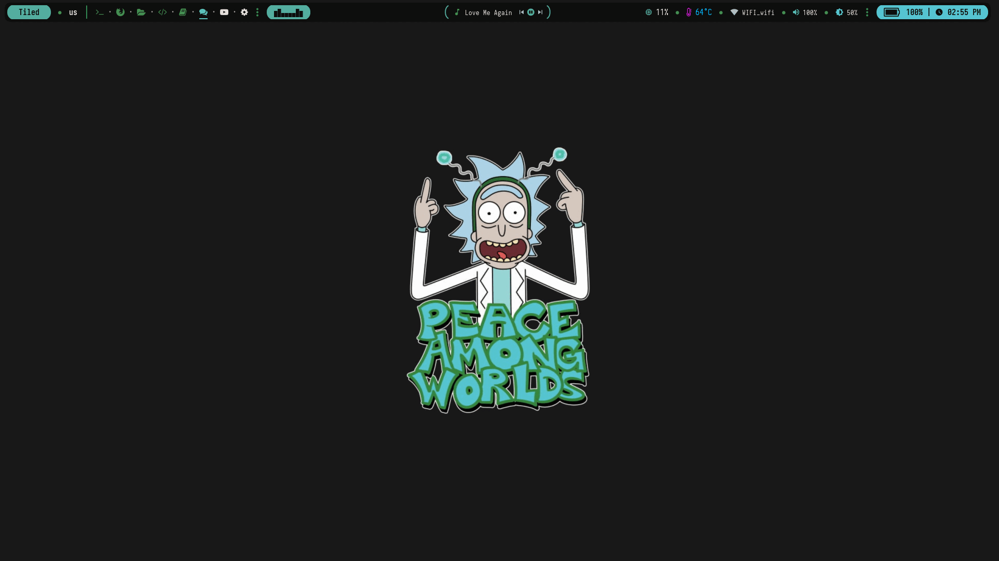
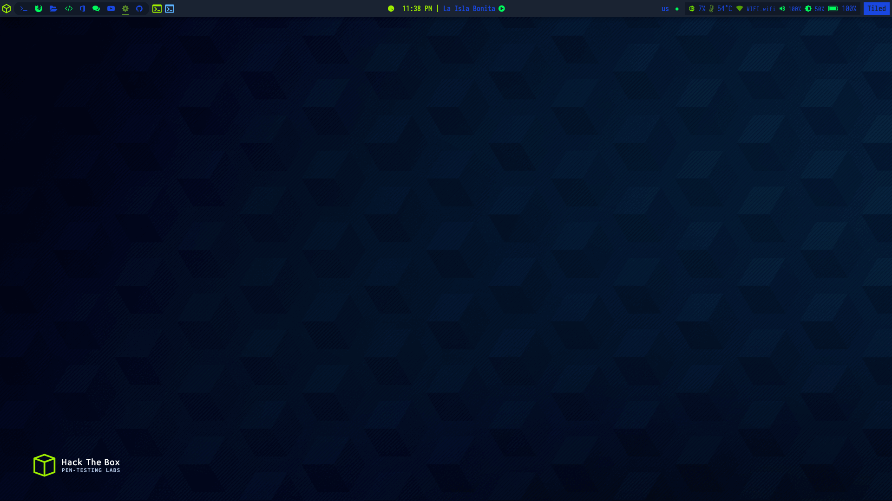
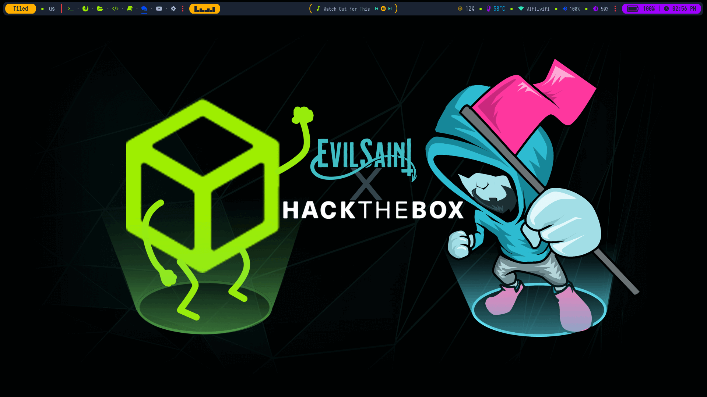
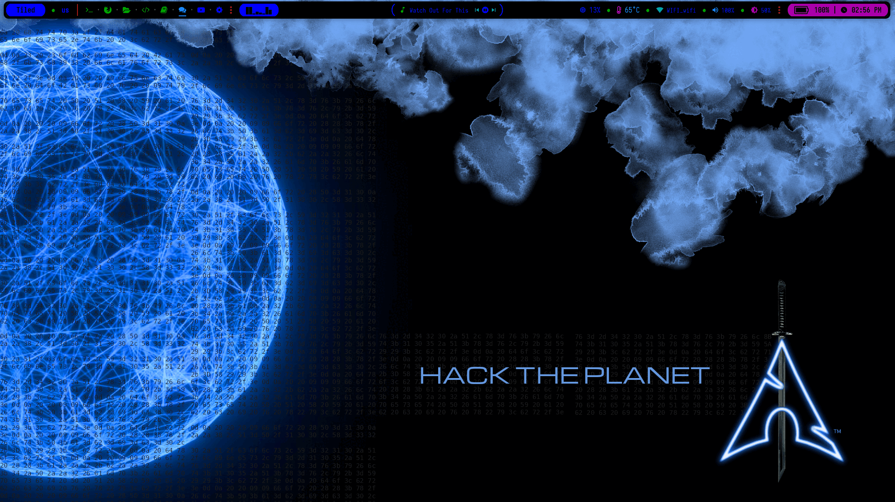
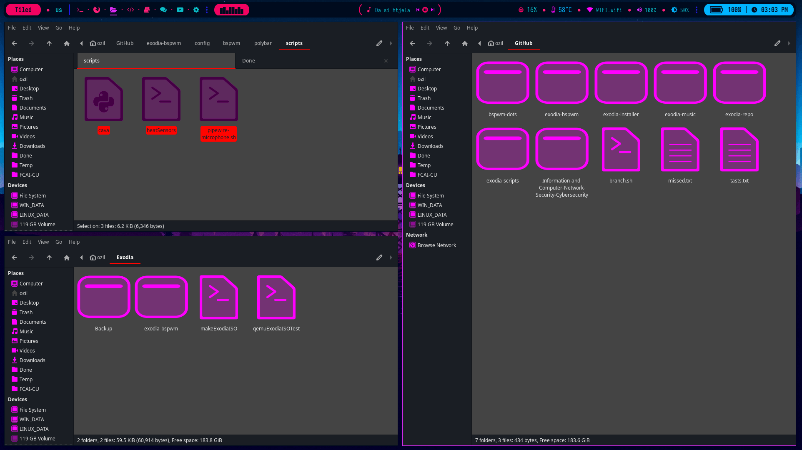
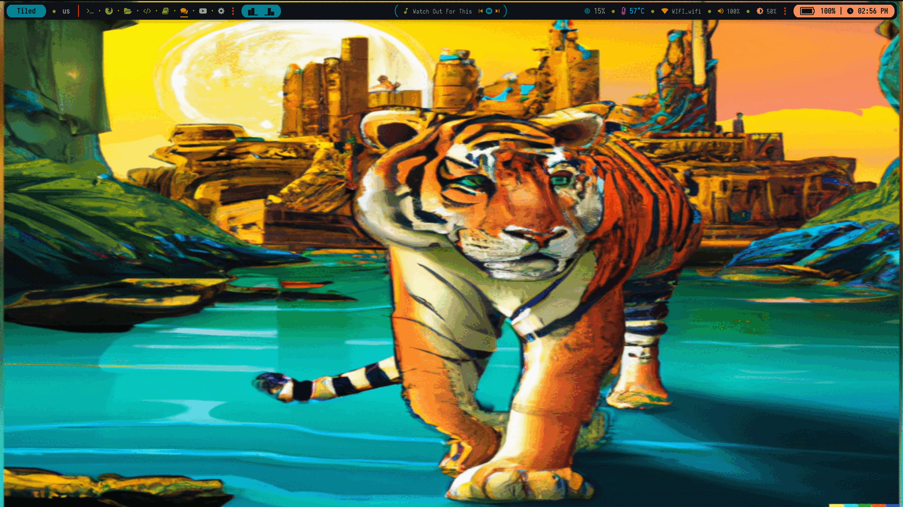

# bspwm-Exodia 
BSPWM Configurations for exodia

<!-- ###########################################  ########################################### -->

<!-- Available Themes Previews -->

<h2 align="center">Available Themes Previews</h2>

|Blade|CyberPunk|Hack|
|--|--|--|
|  |  |  |

|Rick|Hack The Box|Hack The Box Colored|
|--|--|--|
|  |  |  |

|BlackArch|Neon|Tigger In Atlantis|
|--|--|--|
|  |  |  |

|Bouquet|Dracula|Nord|
|--|--|--|
|  |  |  |

|Groot|Gruvbox|
|--|--|
|  |  |

<!-- Available Themes Previews -->

<!-- ########################################### END ########################################### -->